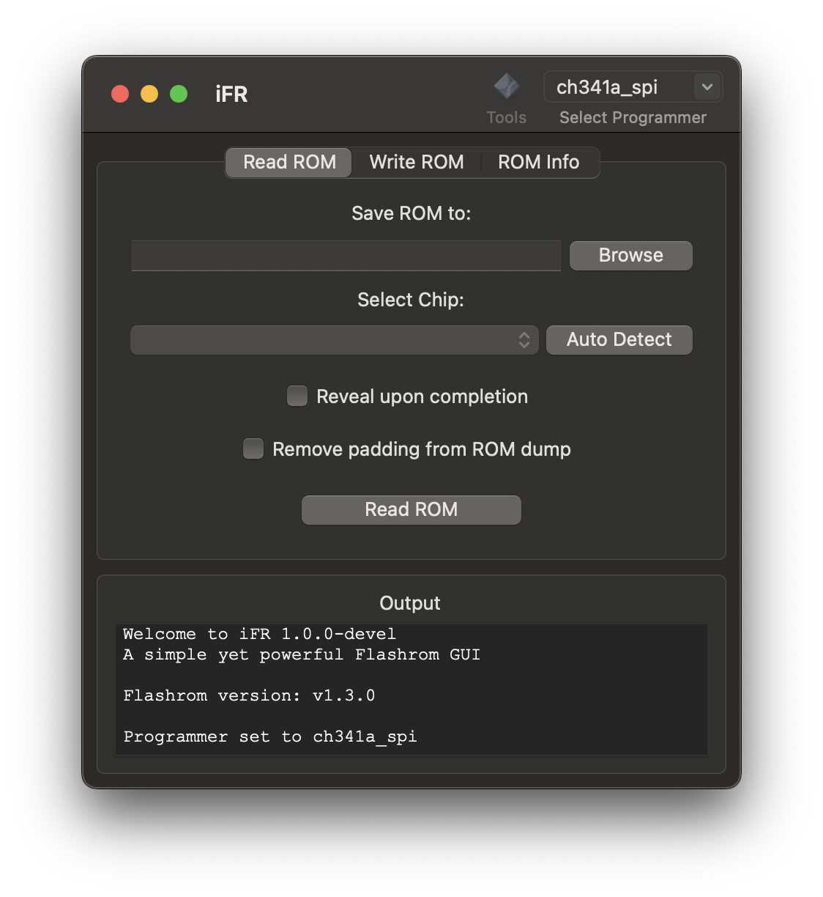

             
             <h1>iFR</h1>
             <i>A simple yet powerful Flashrom GUI</i>
             

## Features
- Native Flashrom GUI
- Read and write ROM images
- Pad/unpad ROM images
- View ROM chip information
- Cross-platform
    - Support for macOS, Linux, and Windows
- Object-oriented Python 3 design with intuitive WxPython interface
- Open source
    - GNU GPL v2.0

## Planned Features
- [ ] ROM Image verification/checksum
- [ ] Standalone padding/unpadding
- [ ] ROM chip erasing
- [ ] Embedded Flashrom binary

## Requirements
### Standalone Binary (macOS, Windows)
- `Flashrom` installed and in PATH
- OS X 10.10 or newer, Windows 7 or newer
### Running from Source
- Python 3.6+
- WxPython 4.1.0+
- `Flashrom` installed and in PATH

## Installation
- Download the latest release from the [releases page](https://github.com/Jazzzny/iFR/releases)
- Install `Flashrom` and add it to your PATH
- Run the binary

## License
iFR is licensed under the GNU GPL v2.0. See [LICENSE](LICENSE) for more information.